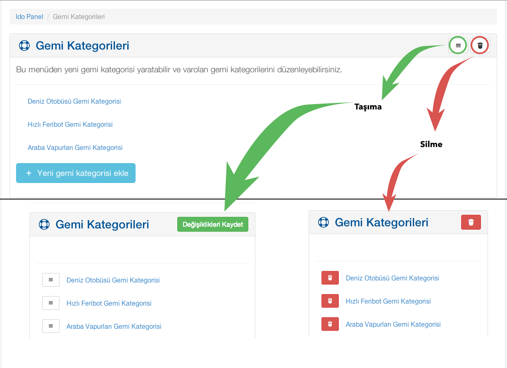

[Index](README.md)

#Genel Amaç Butonları

Tüm sayfalarda girdiğiniz veri başlıklarını silmek veya sırasını değiştirmek için kullanabileceğiniz butonlar mevcuttur. Aşağıdaki ekran görüntüsünde de görebileceğiniz gibi; çöp kutusu butonu verileri silmeye, 3 çizgili menü butonu da sırasını değiştirmeye yarar.

Butonlardan birine tıkladıktan sonra, silme işlemi için tekrar silmek istediğiniz verinin yanındaki kırmızı çöp butonuna tıklayabilirsiniz.
Sırasını değiştirmek için ise mouse ile basılı tutarak dilediğiniz sıraya doğru sürükleyebilirsiniz.

