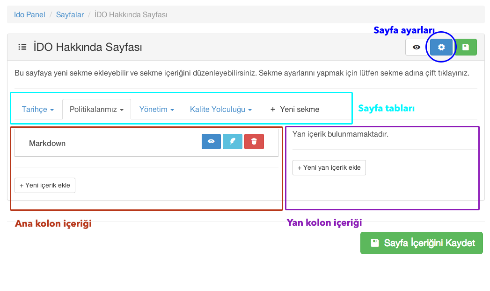
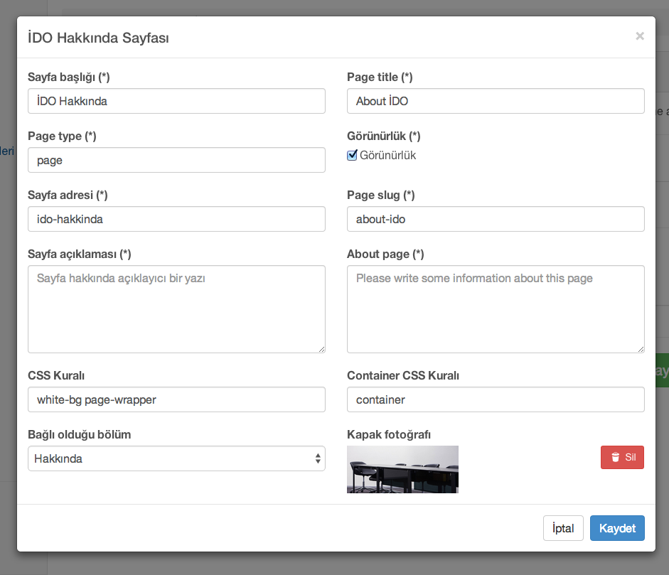

[Index](README.md)

#[Sayfalar](pages.md)
Bu menüden yeni sayfa yaratabilir, İDO Websitesindeki Yolculuk, Kurumsal ve Diğer bölümlerdeki sayfaların içeriklerini düzenleyebilir, yeni sayfa ekleyebilirsiniz

Yeni sayfa ekleme ekranında,  yukarıda da işaretlendiği gibi, sayfa ayarlarına, sayfa tablarına ve ayarlarına, sayfa ana kolon ve yan kolon olmak üzere iki içerik paneline, ve kaydetme, ayrıntılı görme fonksiyonları bulunmaktadır.

###Sayfa ayarları

**Sayfa başlığı** Türkçe sayfa başlığı
**Page title** İngilizce sayfa başlığı