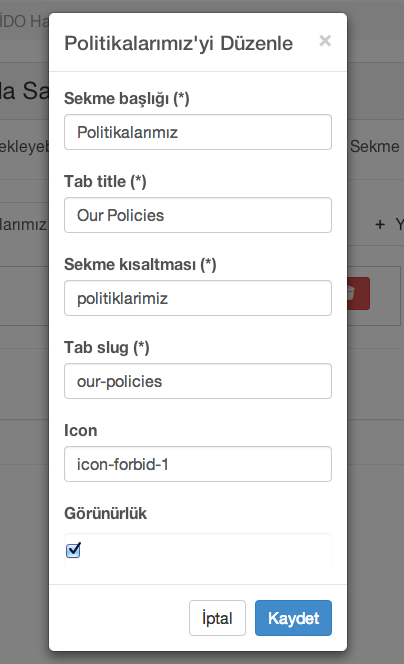

[Index](README.md)

#[Sayfalar](pages.md)
Bu menüden yeni sayfa yaratabilir, İDO Websitesindeki Yolculuk, Kurumsal ve Diğer bölümlerdeki sayfaların içeriklerini düzenleyebilir, yeni sayfa ekleyebilirsiniz

Yeni sayfa ekleme ekranında,  yukarıda da işaretlendiği gibi, sayfa ayarlarına, sayfa tablarına ve ayarlarına, sayfa ana kolon ve yan kolon olmak üzere iki içerik paneline, ve kaydetme, ayrıntılı görme fonksiyonları bulunmaktadır.

#Sayfa ayarları

| Başlık | Açıklama          |
| ------------- | ----------- |
| **Sayfa başlığı**      | Türkçe sayfa başlığı |
| **Page title**     | İngilizce sayfa başlığı    |
| **Page type**     | Sayfanın türü, 'page' yazmanız yeterlidir    |
| **Görünürlük**     | Sayfanın menüde görününür olup olmaması   |
| **Sayfa Adresi**     | Sayfanın adres anahtarı (SEO amaçlı)   |
| **Page slug**     | Sayfanın adres anahtarı ingilizce (SEO amaçlı)   |
| **Sayfa açıklaması**     | Türkçe sayfa açıklaması    |
| **About Page**     | İngilizce sayfa açıklaması    |
| **Css kuralı**     |    |
| **container css kuralı**     |    |
| **Bağlı olduğu bölüm**     |  Hiyerarşik yapı    |
| **Kapak fotoğrafı**     |    |
 
 
#Tab Ayarları

Sayfa tablarından herhangi birine tıkladığınızda, görüntüleme, ayarlar ve sil hareketlerinden birisini seçebilirsiniz.
Tabları sürükleyerek istediğiniz sıraya koyabilir, sıralarını ayarlayabilirsiniz. 

Ayarlara tıkladığınızda karşılaşacağınız ekranda:

| Başlık | Açıklama          |
| ------------- | ----------- |
| **Sekme başlığı**      | Türkçe tab başlığı |
| **Tab title**     | İngilizce tab başlığı    |
| **Sekme kısaltması**     | Tabın adres anahtarı (SEO amaçlı)   |
| **Page slug**     | Tabın adres anahtarı ingilizce (SEO amaçlı)   |
| **Görünürlük**     | Tabın sayfada görününür olup olmaması   |