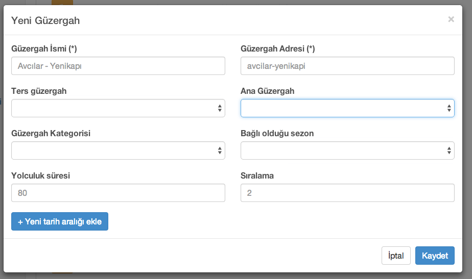
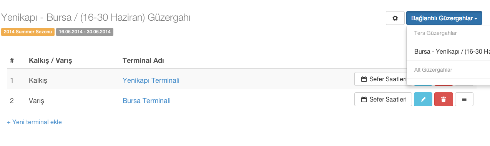

[Index](README.md)

#Güzergahlar

###Ekleme Ekranı

| Başlık | Açıklama          |
| ------------- | ----------- |
| **Güzergah İsmi**      | Türkçe Slide başlığı |
| **Güzergah Adresi**     | güzerhah adresi (SEO amaçlı)   |
| **Ters Güzergah**     | Dönüş güzergahı   |
| **Ana Güzergah**     | Bağlı olduğu güzergah  |
| **Güzergah Kategorisi**     |   |
| **Bağlı olduğu sezon**     |    |
| **Yolculuk süresi**     | Dakika olarak yazabilirsiniz   |
| **Sıralama**     | Seçtiğiniz tipe göre yeni içerik kutuları doldurmanız gerekebilir.   |

###Güzergah Düzenleme Ekranı

Bu ekranda güzergaha bağlı varış ve kalkış terminallerini düzenleyebiliyoruz, bağlantılı güzergahları görebiliyoruz.
Sefer saatlerine tıklayarak Güzergahın seçtiğiniz Terminal ile ilgili saatlerini düzenleme ekranına erişebiliyoruz.

### Terminal Saatleri

Bu ekranda Güzergahın seçili terminali için günlere bölünmüş sefer saatlerini düzenleyebiliyoruz.

Eklemek istediğiniz saatleri 'Saat Listesi'ne virgül ile ayırarak yazıp ekle tuşuna bastığımıza, eklediğimiz saatler hemen alt tarafına kutu olarak geliyor.
Bu saat kutularının üstüne tıklayarak eğer varsa o saat ile ilgili notları girebilirsiniz.
(Yada o saatte sefer yoksa not kısmına '-' tire işaretini koyarak, sefer olmadığını belirtebilirsiniz )

Bir alttaki 'Haftanın günleri' seçeneklerinden geçerli olduğu günleri işaretleyebilirsiniz.

