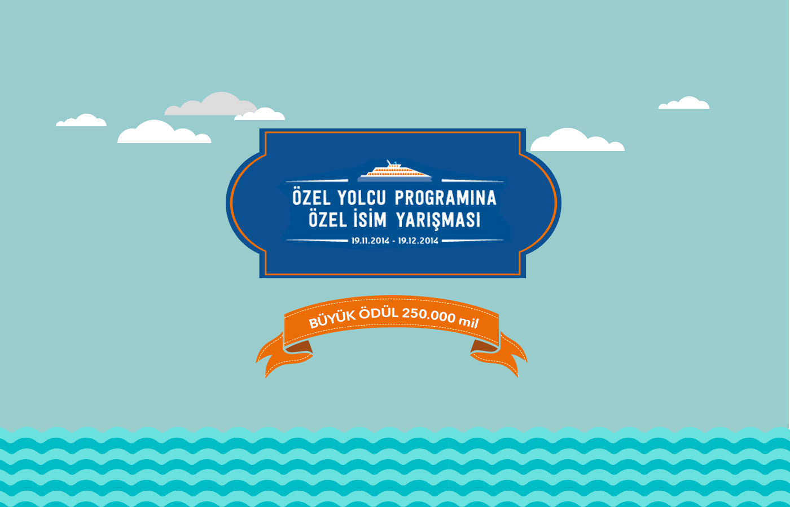

[Index](README.md)

#Ana sayfa slide hazirlama rehberi

Ana sayfaya 'slide' hazırlarken, arkaplan ve önplan olarak iki farklı katman ile düşünülmesi gerekiyor.

Eski İDO sitesindeki bannerlara benzer 2 katmanlı slide örnekleri inceleyebilirsiniz:

Yada <a href="slides/psd.zip">.PSD dosyaları linkten </a> indirebilirsiniz.

##slide 1

#####Arkaplan

#####Önplan

#####Önizleme

##slide 2

#####Arkaplan

#####Önplan

#####Önizleme

